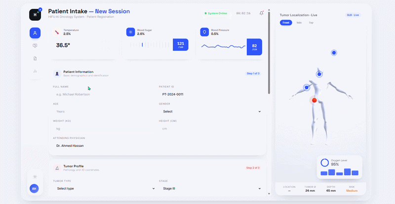
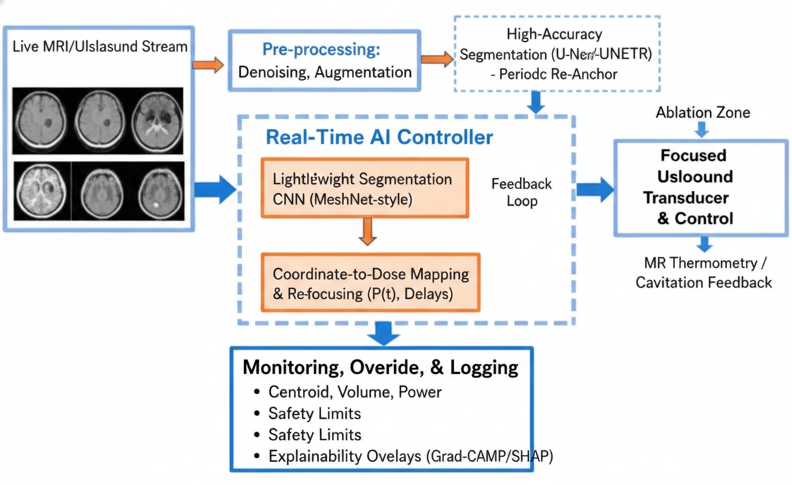

# MorphFUS: The AI-driven acoustic shield that locks onto shifting tumors, dynamically re-shaping focused ultrasound to protect healthy tissue in real-time.
 
<p align="center">
 
</p>
 
A minimal, runnable version of the core idea from the underlying research: **the
tumor-tracking network and the ablation controller are not separate,
one-shot steps — they run in a continuous loop, each cycle informing the
next.** This repo is a software-architecture prototype of that loop, built to
be replaced piece-by-piece with clinically validated components as described
below.
 
```
frame -> detect_tumor() -> measurement -> controller.compute_command()
      -> command (power, focal size) -> apply to tissue -> tumor changes
      -> next frame ...
```
 
## Research basis
 
This prototype follows the closed-loop architecture proposed in *"Closing
the Loop: Deep-Learning-Guided Real-Time Tumor Tracking for Adaptive Power
Control in Focused Ultrasound Therapy."* The paper's core argument: clinical
focused ultrasound (FUS) systems set power and frequency before treatment
and hold them largely fixed for the session, even though the tumor is
shrinking, moving with breathing and pulsation, and changing its acoustic
properties as it necroses. Existing MR-guided FUS (MRgFUS) systems already
close a loop, but around a proxy signal — focal temperature (MR
thermometry) or cavitation-emission amplitude — not around the tumor's own
measured geometry.
 
The paper proposes closing that gap with a five-stage pipeline, which this
repo mirrors at prototype scale:
 
<!--
  ARCHITECTURE DIAGRAM PLACEHOLDER
  Insert the paper's closed-loop architecture figure here, e.g.:
  
-->
<p align="center">
  
</p>
 
1. **Real-time volumetric acquisition** — a live imaging stream (fast
   interleaved MRI, or ultrafast volumetric ultrasound via coherent
   plane-wave compounding) rather than a single pre-treatment scan.
2. **Deep-learning tumor localization and volume estimation** — a 3D
   segmentation network (3D U-Net / Swin-UNETR family for accuracy, a
   lightweight MeshNet-class network for interactive-speed tracking between
   anchor points) reduces each incoming volume to a tumor centroid (x, y, z)
   and a current volume estimate V(t).
3. **Coordinate-to-dose mapping** — the paper's central proposal, and the
   piece of the literature it argues is still missing: a control law that
   scales transmitted power with the fraction of untreated tumor remaining,
```
   P(t) = P_min + (P_max − P_min) · f(V(t)/V0)
```
 
   while a separate, faster cycle re-steers the focal point to the tumor's
   current centroid.
4. **Actuation and re-focusing** — per-element transmit delays and
   amplitudes recomputed for the new target and power, using model-based
   deep learning (e.g. ABLE-style learned beamforming) to keep this fast
   enough to run every cycle.
5. **Monitoring, override, and logging** — every cycle's centroid, volume,
   commanded power, and thermometry/cavitation reading logged together,
   with a hard manual override and absolute power ceiling that sit
   independent of the learned/geometric control layers.
 
`detection.py`, `controller.py`, and `run_closed_loop.py` in this repo are a
runnable, non-clinical stand-in for stages 2–3 of that pipeline — enough to
validate the control-loop *software architecture* before any real imaging or
transducer hardware is involved.
 
## Files
 
- `tumor_sim.py` — stands in for a real patient/ultrasound feed (stage 1).
  Generates synthetic B-mode-style frames with speckle noise and a tumor
  that shrinks according to applied power. **This is the piece you replace
  first.**
- `detection.py` — the perception step (stage 2, simplified). Currently
  classical CV (threshold + contour + min enclosing circle) rather than a
  3D U-Net/Swin-UNETR segmentation network. Returns a `TumorMeasurement`
  with position, radius, area, and a confidence score.
- `controller.py` — the decision step (stage 3, simplified). Turns a
  measurement into a `ControlCommand` (power, focal spot radius, fire/no-fire),
  implementing a first-order version of the paper's coordinate-to-dose
  mapping, with:
  - power scaled to remaining tumor volume, hard-capped
  - focal spot tracking tumor size (shrinks together with it, so it stops
    irradiating healthy tissue that used to be tumor)
  - a taper zone near the stop threshold so the last bit is finished gently
  - a **confidence gate**: low-confidence detections drop power to minimum
    instead of trusting a noisy read — this is the safety-critical part, and
    a stand-in for the paper's requirement that segmentation uncertainty
    gate the automatic loop's authority, falling back to a thermometry-only
    control law when confidence drops
- `run_closed_loop.py` — runs the loop end to end, logs every cycle to
  `loop_log.csv`, saves an overlay frame every 10s to `frames/`, and produces
  `closed_loop_summary.png` (tumor radius / power / focal size vs. time).
## Run it
 
```bash
pip install -r requirements.txt
python3 run_closed_loop.py
```
 
## Using the uploaded real datasets
 
This repository now includes support for the uploaded real data in `Data/01` and `Data/02`.
 
- `Data/01/Flowmeter` contains the ultrasonic flowmeter diagnostics CSV files.
- `Data/02/Radio-Freqency/Pre-clinical _ultrasound_dataset/all_cases` contains the ultrasound Analyze 7.5 volumes and segmentation masks.
New helper scripts:
 
```bash
python3 train_flowmeter.py
python3 train_ultrasound_segmentation.py
python3 train_ultrasound_unet.py --max-cases 4 --epochs 1 --batch-size 2
python3 prepare_ultrasound_dataset.py --case-id Cage01_BL --slice-index 6
python3 run_ultrasound_replay.py --case-id Cage01_BL --slice-index 6 --model-path models/ultrasound_unet.pth
python3 run_closed_loop_on_dataset.py --case-id Cage01_BL --max-slices 8 --slice-step 2 --model-path models/ultrasound_unet.pth
```
 
`train_flowmeter.py` trains a simple classifier on the flowmeter dataset and saves a model to `models/`.
`train_ultrasound_segmentation.py` trains a baseline pixel-level segmentation model on the uploaded ultrasound dataset and saves it to `models/`.
`prepare_ultrasound_dataset.py` loads an ultrasound volume and segmentation mask, exports a representative slice, and prints the case metadata.
`run_ultrasound_replay.py` runs the detector on a real ultrasound slice and saves an overlay image for visual inspection. Pass `--model-path` to run the trained segmentation model instead of the default classical CV detector. If you use a `.pth` model, a working PyTorch install is required; if PyTorch is unavailable, use the `.pkl` segmentation model instead.
`run_closed_loop_on_dataset.py` replays a sequence of real ultrasound slices through the existing controller, logging control commands and saving summary plots.
 
The existing synthetic closed-loop demo remains unchanged, but these helpers demonstrate the first real-data integration path. Note that the paper's reference segmentation stack (3D U-Net / Swin-UNETR, trained on BraTS-style four-modality MRI) targets brain tumor segmentation; the uploaded pre-clinical ultrasound dataset used here is a different imaging modality and tumor type, so `train_ultrasound_segmentation.py` / `train_ultrasound_unet.py` should be read as validating the *control-loop integration path* against real volumetric ultrasound data, not as a drop-in BraTS-equivalent model.

Programmed By: **Raneem Sa'deh🌚✨**
